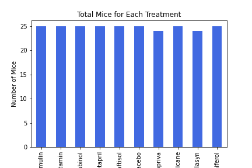
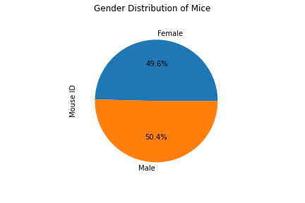
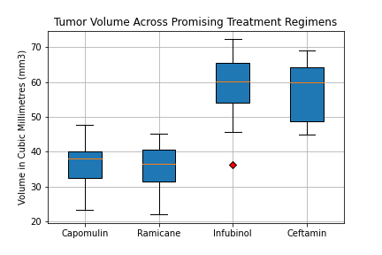
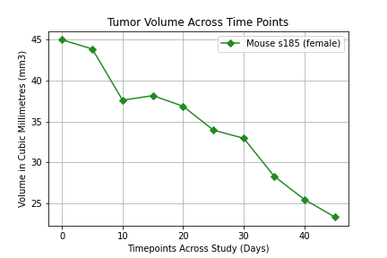
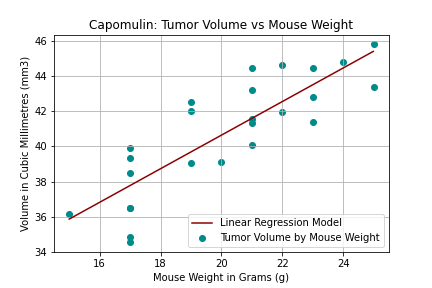

# matplotlib-challenge

## Background:

#### Pymaceuticals Inc. is a burgeoning pharmaceutical company based out of San Diego. Pymaceuticals specializes in anti-cancer pharmaceuticals. In its most recent efforts, it began screening for potential treatments for squamous cell carcinoma (SCC), a commonly occurring form of skin cancer.

#### In this study, 249 mice identified with SCC tumor growth were treated through a variety of drug regimens. Over the course of 45 days, tumor development was observed and measured. The purpose of this study was to compare the performance of Pymaceuticals' drug of interest, Capomulin, versus the other treatment regimens. 

## Data Cleaning:

#### Before beginning, the data was checked for any mice with duplicate timepoints. It was discovered mouse g989 had duplicate timepoints with tumor volumes that were different for each timepoint
 - The data was discovered by creating a data frame with Mouse ID and Timepoint columns and using duplicated.
 - Once it was discovered that the tumor volumes were not consistent for the duplicate timepoints, a cleaned dataframe was made by using df.drop with the duplicate Mouse ID. 
 
## Summary Statistics:

#### The summary statistics that were requested were the mean, median, variance, standard deviation, and standard error of the mean (SEM)
 - This was achieved by using the newly cleaned data frame, grouping by the Drug Regimen and using DataFrame.agg. 

## Bar and Pie Charts:

#### For both the bar and pie charts, two were made upon request - first using pandas, then using matplotlib. Both were identical in output. 
 - The bar chart shows the total number of mice for each treatment regimen throughout the study. This was created by grouping by the Drug Regimen and using nunique() on the Mouse ID. 

 - The pie chart show the gender distribution of all mice in the study. This was created by grouping by Sex and using nunique() on the Mouse ID. 
 

## Quartiles, Outliers, and Boxplots:

#### In order to caluclate quartlies and outliers for the boxplot for 4 treatment regimens (Capomulin, Ramicane, Infubinol, and Ceftamin), first a new dataframe had to be made consisting of the last tumor volume for each mouse. 

 - This was created by getting the maximum time point while grouping by Mouse ID and mergine this dataframe with a new dataframe that consisted of Mouse ID, Timepoint, Drug Regimen, and Tumor Volume. Next, only the tumor volume for each drug regimen were put into their respective series using loc. 
 - To determine if there were tumor volumes outliers amoung any of the 4 treatment regimens, all 4 series were put into a data frame. With this new data frame, quartile 1 (0.25), quartile 3 (0.75), interquartile range, max volume, min volume, upper bounds and lower bounds were each calculated. These were then put into a new data frame for comparison and output.
 - To create the boxplot, all 4 series were put into a list and passed into plt.boxplot with formatting. 
 

 
 ## Line Plot
 
 #### For the line and scatter plots, only data from the Capomulin treatment regimen was used. 
 - To create theh line plot showing the tumor volume over time, the data of only one mouse was used. The x-axis consisted of timepoints across the study and the y-axiz consisted of the tumor volume. This was passed into plt.plot along with formatting. 
 

### Scatter Plot and Correlation and Regression
 - The scatter plot was made to assess mouse weight and average tumor volume for the mice under the Capomulin treatment regimen. This was created by grouping on Mouse ID and calculating the mean of the mouse weight and tumor volume. This was passed into plt.scatter with formatting. 
 - In order to display linear regression over the previous scatter plot, Linear Regression from Scikit-Learn was used. The model was trained and a function was created to pass into plt.plot for display with the scatter plot. 
 
 
 

